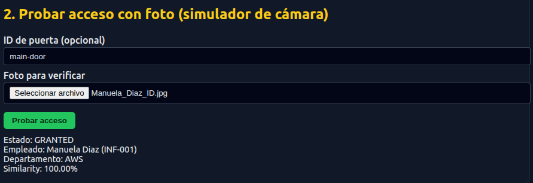
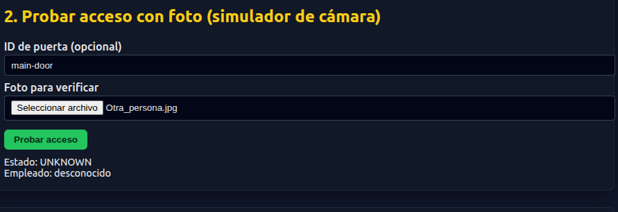
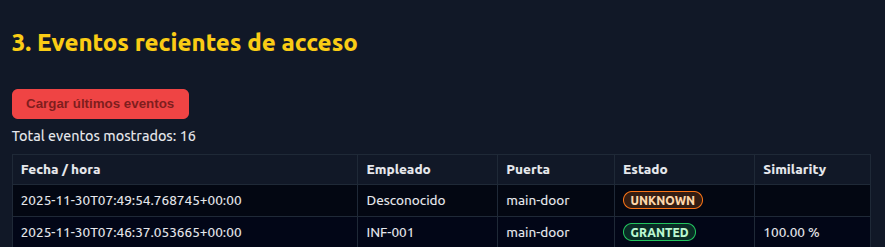

# 🛡️ Sistema de Control de Acceso Biométrico (AWS Serverless)

## Realizado por:

- **Jose Aldair Molina Mendes:** jmoliname@unal.edu.co
- **Laura Ruiz Aarngo:** lruizar@unal.edu.co

Este repositorio contiene el código fuente y la documentación de una aplicación de seguridad que utiliza **Inteligencia Artificial (Amazon Rekognition)** para gestionar el acceso físico de empleados mediante reconocimiento facial.

---

## 📋 Tabla de Contenidos
- [Descripción General](#-descripción-general)
- [Arquitectura del Sistema](#-arquitectura-del-sistema)
- [Estructura del Repositorio](#-estructura-del-repositorio)
- [Tecnologías](#-tecnologías)
- [Manual de Usuario (Paso a Paso)](#-manual-de-usuario-paso-a-paso)
- [Instalación y Ejecución](#-instalación-y-ejecución)

---

## 📖 Descripción General

El sistema simula un panel de control de seguridad que permite:
1.  **Enrolar (Registrar):** Dar de alta a nuevos empleados subiendo su foto de referencia y datos a la nube.
2.  **Simular Acceso:** Actuar como una cámara de seguridad que valida si una persona tiene permiso de entrada.
3.  **Auditoría:** Visualizar un historial de eventos (accesos concedidos, denegados y similitud biométrica).

---

## 🏗 Arquitectura del Sistema

El backend es completamente **Serverless** (sin servidor), lo que garantiza escalabilidad y bajo costo.

* **Frontend:** HTML5 + Vanilla JS (Cliente).
* **API Gateway:** Punto de entrada seguro (HTTPS).
* **AWS Lambda:** Procesa la lógica (recibe la imagen en Base64 y coordina los servicios).
* **Amazon Rekognition:** Compara la "Foto de Acceso" contra la "Colección de Rostros" de empleados.
* **Amazon DynamoDB:** Base de datos NoSQL que guarda la metadata del empleado y los logs de acceso.
* **Amazon S3:** Almacenamiento de las fotografías.

---

## 📂 Estructura del Repositorio

Para que la aplicación funcione correctamente, mantén la siguiente organización de archivos:

```text
.
├── index.html          # Interfaz gráfica principal (Panel de Control)
├── app.js              # Lógica del cliente y conexión a API Gateway
├── README.md           # Este archivo de documentación
└── img/                # (Opcional) Carpeta para guardar capturas del manual
```
---

## 🛠 Tecnologías

* **Frontend:** HTML5 y JavaScript.
* **Nube (AWS):** Lambda, API Gateway, DynamoDB, Rekognition, S3.
* **Formato de Intercambio:** JSON y Base64 para imágenes.

---

## 📚 Manual de Usuario (Paso a Paso)

### ⚠️ Advertencias e Instrucciones Previas
* **Formato de Imagen:** El sistema solo acepta archivos de imagen estándar (**JPG, JPEG, PNG**). No intente subir PDFs o archivos de texto.
* **Calidad:** Para un funcionamiento óptimo, la cara debe estar descubierta, bien iluminada y mirando de frente.
* **Conexión:** Se requiere conexión a internet activa para comunicarse con los servicios de AWS.

### 1. Registro de Empleados (Enrolamiento)
Esta función agrega una persona a la base de datos autorizada.

1.  Ubique la sección **"1. Agregar empleado (enrolar)"**.
2.  Llene los campos:
    * **ID:** Identificador único (ej: `FISICA-001`).
    * **Nombre:** Nombre completo.
    * **Departamento:** Área de trabajo.
3.  **Foto:** Haga clic en "Seleccionar archivo" y cargue una foto tipo documento.
4.  Pulse **"Registrar empleado"**.
5.  **Resultado:** Verá un mensaje de confirmación con los datos guardados en la nube.


### 2. Validación de Acceso (Simulador)
Esta función simula lo que haría la cámara en la puerta.

1.  Ubique la sección **"2. Probar acceso"**.
2.  **ID de Puerta:** (Opcional) Puede dejarlo en blanco o poner `Laboratorio-1`.
3.  **Foto:** Cargue una foto **diferente** a la del registro (otra pose, otra iluminación) para probar la IA.
4.  Pulse **"Probar acceso"**.
5.  **Resultado:**
    * 🟢 **GRANTED (Acceso Concedido):** Si la IA reconoce el rostro (Similitud > 90%).
    
    * 🔴 **DENIED (Acceso Denegado):** Si el rostro no está en la base de datos.
    * 🟠 **UNKNOWN:** Si no detecta ningún rostro válido.
    


### 3. Historial de Eventos
Permite ver quién ha intentado entrar.

1.  Vaya a la sección **"3. Eventos recientes de acceso"**.
2.  Haga clic en el botón rojo **"Cargar últimos eventos"**.
3.  Se desplegará una tabla mostrando:
    * Fecha y Hora exacta.
    * ID del empleado (o "Desconocido" si falló).
    * Porcentaje de Similitud (Confianza de la IA).



---

## ⚙️ Instalación y Ejecución

No se requiere instalar servidores ni librerías complejas (Node.js/Python) en su máquina local, ya que todo el procesamiento ocurre en la nube.

1.  **Descargar:** Clone este repositorio o descargue los archivos `index.html` y `app.js`.
2.  **Ejecutar:**
    * Haga doble clic en `index.html` para abrirlo en su navegador predeterminado.
    * **Recomendación:** Si usa VS Code, utilice la extensión *"Live Server"* para evitar problemas de caché local.
3.  **Configuración de API:**
    * El archivo `app.js` ya contiene la dirección de enlace con la infraestructura AWS desplegada:
    ```javascript
    const API_BASE = "[https://r3s2i2pyf7.execute-api.us-east-1.amazonaws.com/dev](https://r3s2i2pyf7.execute-api.us-east-1.amazonaws.com/dev)";
    ```